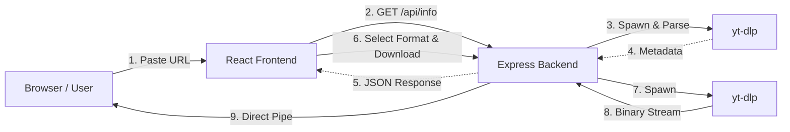

# VdDownloader


A modern, high-speed, and secure video/audio downloader built on the MERN stack and powered by `yt-dlp`. It supports downloading from over 1000+ websites including YouTube, Facebook, Instagram, Twitter/X, TikTok, and Reddit.

## 🖼️ Screenshots / Demo

<!-- **TODO:** Add your screenshots or GIFs here showing the demo in action! -->
<!-- Example: -->
<!--  -->

## 🚀 Key Functionality

1. **Direct Streaming Architecture**  
   Unlike traditional downloaders that save files to the server's hard drive first, VdDownloader establishes a live data pipe. The backend spawns `yt-dlp` to fetch the media and streams the `stdout` binary data directly into the user's browser HTTP response. This guarantees maximum download speed and zero server bloat.

2. **2-Step Rich Interface Flow**  
   - **Phase 1 (Fetch Info):** The `/api/info` endpoint queries the video link to safely fetch metadata. It returns the video's original title, platform (e.g., youtube, facebook), high-quality thumbnail, and scans the system for native resolutions.
   - **Phase 2 (Selection & Stream):** The React frontend renders a beautiful video card with dynamic quality dropdowns (from 144p to 8K, plus an Audio Only option). Submitting calls `/api/stream` with the exact `format_id`, bypassing guessing logic for 100% reliable downloads.

3. **FFmpeg-Free Audio Handling**  
   Built to survive on minimalist servers without `ffmpeg` installed. The application requests native, pure audio streams and securely pipes them to the client with an `.mp3` file extension.

4. **Monetization & AdSense Ready**  
   The UI includes perfectly positioned Google AdSense placeholders (`<ins className="adsbygoogle">`) and a unified `AdPlacement` component ready for dynamic publisher injection.

5. **Premium UI/UX Design**  
   A state-of-the-art frontend featuring frosted glass (glassmorphism) effects, vibrant gradient backdrops, micro-animations, loading spinners, download progress, and an SEO-friendly layout (Hero sections, Feature arrays, Footer).

## 🏗️ Architecture



## 🛠️ Technology Stack

### Frontend
- **React.js**: Core frontend logic structure.
- **Tailwind CSS**: Full application styling. Used for precise gradients, flexbox configurations, hover states, and responsive design.
- **JavaScript (ES6+)**: `fetch` API, Native `ReadableStream` & `Blob` interactions for piecing together incoming bytes into a downloadable OS file.

### Backend
- **Node.js**: Asynchronous environment to handle non-blocking live streams.
- **Express.js**: Request routing (`/api/stream`, `/api/info`) and HTTP header formulation (custom `Content-Disposition` for URI encoded filenames).
- **MongoDB / Mongoose**: Database connectivity initialized in server start up.
- **yt-dlp**: The powerhouse Python binary handling the heavy lifting of extracting stream URLs from proprietary platforms.
- **Node `child_process`**: Uses `spawn` to run yt-dlp safely and capture continuous command-line output securely.

### Tools & Configuration
- **Dotenvx**: Secure environment management handling ports, secrets, and API keys.

## 📦 How to Run

### 1. Start the Backend
```bash
cd video-downloader/backend
npm install
npm start
```

### 2. Start the Frontend
```bash
cd video-downloader/frontend
npm install
npm start
```

## 🔧 Troubleshooting

* **yt-dlp not found in PATH**
  Ensure `yt-dlp` is installed and globally available in your system's PATH. If not, create a `backend/.env` file and manually set the absolute path via `YTDLP_PATH=/path/to/yt-dlp`.

* **FFmpeg missing for 1080p+ YouTube merging**
  Downloading 1080p+ video with sound from YouTube requires `ffmpeg` to merge streams. If not available in PATH, yt-dlp may fail or return silent videos. Install FFmpeg globally first.

* **CORS errors in development**
  By default, the backend allows `http://localhost:3000`. If you run on a different port, set `ALLOWED_ORIGINS` dynamically in `backend/.env` (e.g. `ALLOWED_ORIGINS=http://localhost:5173,https://my-site.com`).

* **MongoDB connection failures**
  If using `MONGO_URI`, ensure your database accepts inbound connections (e.g. correct IP allowlist on MongoDB Atlas). If you don't need a DB, simply remove the key from `.env`.

## ⚖️ Legal Disclaimer

This application is intended strictly for personal, non-commercial use and educational purposes. Ensure our downloads comply with the Terms of Service for all applicable platforms, and do not infringe on regional copyright and distribution laws. The authors assume no liability for the misuse of this software.
